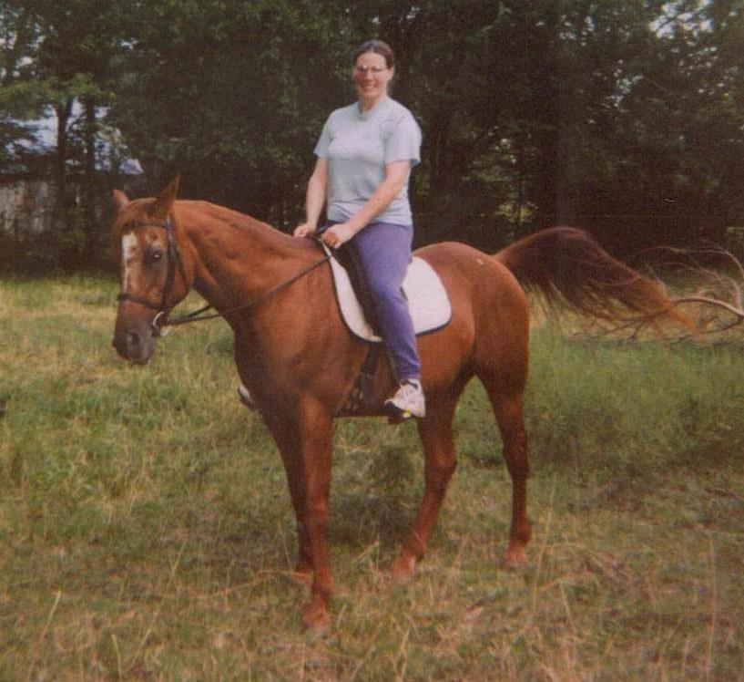

Christie lives on a small farm near Dayton, Ohio with her spouse, three horses, and an indeterminate number of cats.   She grew up in southern California, obtained a bachelor's degree in physics from the Massachusetts Institute of Technology and a Ph.D. degree in physics at the University of California, Davis.  She now researches novel electronic materials and devices by day and writes by night.  Her analytical skills are often turned on her faith, generally resulting in her continued awe at how unfathomable, and yet how real, God is.

Curious about my birthmark?  Here's a site nice site with good information:  [http://kidshealth.org/parent/medical/heart/port_wine_stains.html.](http://kidshealth.org/parent/medical/heart/port_wine_stains.html)  

For me, my birthmark is part of my identity, what makes me special:  A kiss from God.  Where has he kissed you?