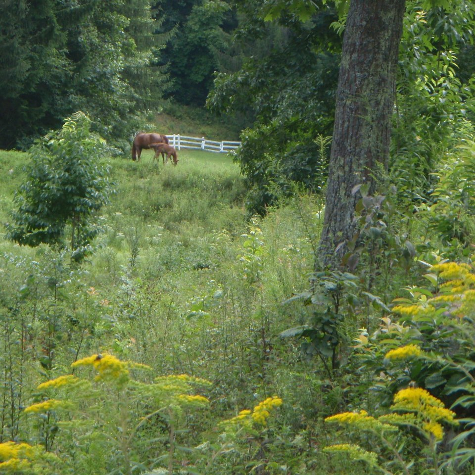

God is a Horseman
=================

When God created Horse, he created a very special animal.  And when he gave Horse to Human, he gave us a chance to experience one of the most incredible relationships a person can have.

The only other relationship I know that compares is the relationship I have with God--except in that relationship, *I'm* the one who gets fed the grain, and has to learn to lower my head to let him put the halter on.

From either perspective, it's a wonderful ride.  I invite you to join with me, my horses, and God, as we discuss living and working with each other.  Read the blog.  Get in (or under) the saddle.

<h1 class='nofloat'>Blog Posts</h1>

I also invite you to check out God is a Horseman's Facebook page at www.facebook.com/GodisaHorseman

