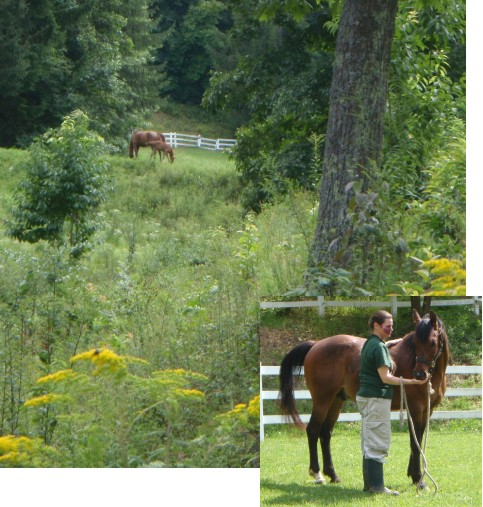

God is a Horseman
=================

horse horse horse

Synopsis
--------

God is a Horseman is an introduction to the unique relationship between horse and horseman.  And, it is an introduction to how that exquisite bond mirrors the bond that God wants to share with us.  
Filled with richly described vignettes portraying colorful horse personalities, and illustrated with pictures of horses in beautiful rural settings, *God is a Horseman* describes how humans can teach horses to trust and willingly serve them, and how can God teach us to love and serve him in the same ways.

Related pages:
--------------

* *God is a Horseman* Character Sketch
* [Jordache:  A Purpose-Driven Horse](Jordache_character_2.html)
* Meet Jordache, one of the colorful equine stars of *God is a Horseman*, up close and personal.

Blog Posts
==========

* [#1:  A One-Eyed Horse](../_posts/2013-07-01-giah_1.html)
* [#2:  Gone](../_posts/2013-07-25-giah_2_gone.html)

