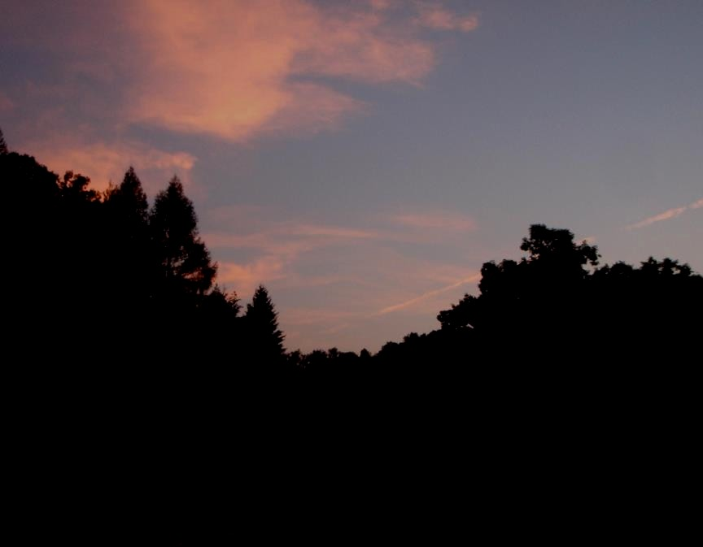

<h3>God is a Horseman #1:</h3>

 

<h3><i>Jordache: A Purpose-Driven Horse</i></h3>

Today I stayed late at work and it's pitch dark by the time I head out to feed my horses.  Feeling the path with my feet more than seeing it, I see a dim equine form ahead, picked out by the beam of the barn's night light shining through an open door.  My old chestnut friend, Jordache, is waiting for me.  

He steps out of the light as I come nearer, his aging, aching bones making his movements slow and deliberate.  A moment later, a low-throated nicker from the darkness in front of my face startles me.  The broad white star on Jordache's forehead looms up and he pushes his graying head into me, eager for my company.  And, more to the point, eager for his dinner, heavy in the buckets in my hands.

Jordache was my first horse, and in the thirty years we've been together--since I was ten and he was a yearling--he has been every kind of horse I needed him to be:  show horse, backyard playmate, barn clown, friend.   He was the  spirited-but-willing riding horse I wanted, but he would notch back that high-strung energy to generously carry children who knew nothing about how to stay on his back.  Now retired, he is still the most interesting personality in the barnyard, wreaking havoc whenever possible and always nosing up to me for a good belly rub or a treat.

With all that, you'd think he'd have a true servant's attitude.  Nothing could be farther from the truth.  In his obvious opinion, he is not here to serve me.  I am here to serve him.  That's not to say he won't do what I ask, at least when I ask loud enough.   That's not to say he isn't a willing servant--when I used to get on his back, he did what I wanted like he was reading my mind.   When I'm on the ground beside him, a word will move him, a glare gets his attention.  But still he seems to believe it's all for his benefit.  Though he knows who really should be in the lead when I put a halter on him, he generally steps out first and expects me to follow.  When I used to saddle him up, he'd start moving his feet and looking at me expectantly, seemingly excited at the prospect of me atop him-- a purpose for his life, perhaps, a chance to be more than just a pasture pony.  And when he feels ill, he puts his head down, comes up to me, and begs me to make him feel better.  

To Jordache, his purpose in life isn't to serve me.  It is I who serves him, by making his life more wonderful than he can by himself.  

It makes me wonder, is this how it is between God and me?  Who is really "serving" who, after all?  And does it matter?  If I can lie down in God's presence with as much peace and trust as Jordache does in mine, if I can bear the burdens God puts on my back knowing God will provide my grain in the end, if I know I can have a better life only by following my God--does it matter if, in the end, I feel like I'm the one who was served?  

Whenever Jordache takes his little liberties with me, assuming my tolerance of even his most annoying antics and my forgiveness for his old-man-grumpy stubbornness, I can't help but smile.  I love this horse, who has been my friend and companion for nearly every day of his long and waning life.  I can't forget all the times he's done what I asked even when it hurt.  When he trusted me and went forward even though every fiber in his prey-animal mind told him to turn and run from the tigers he thought were ahead.  When I was the first thing he came to for healing, and for Joy.

If God is at all the kind of horseman I think he is, when the cantankerous, stubborn, but faithful person nickers to him, calling with the most personal, soul-drenched call their heart can make, he must fill with joy, and his eyes with tears, that he is loved by the one he's loved so long.  And feel that, despite the willfulness, he wants this horse beside him.  Always.

    The Lord is my shepherd;
		I have everything I need.
    He lets me rest in green pastures.
		He leads me to calm water.
    He gives me new strength.
    He leads me on paths that are right
		for the good of his name.
    Even if I walk through a very dark valley,
		I will not be afraid,
    because you are with me.
		Your rod and your shepherd’s staff comfort me.
    You prepare a meal for me
		in front of my enemies.
    You pour oil of blessing on my head;
		you fill my cup to overflowing.
    Surely your goodness and love will be with me
		all my life,
    and I will live in the house of the Lord forever.
		--Psalm 23 (NCV)

 

