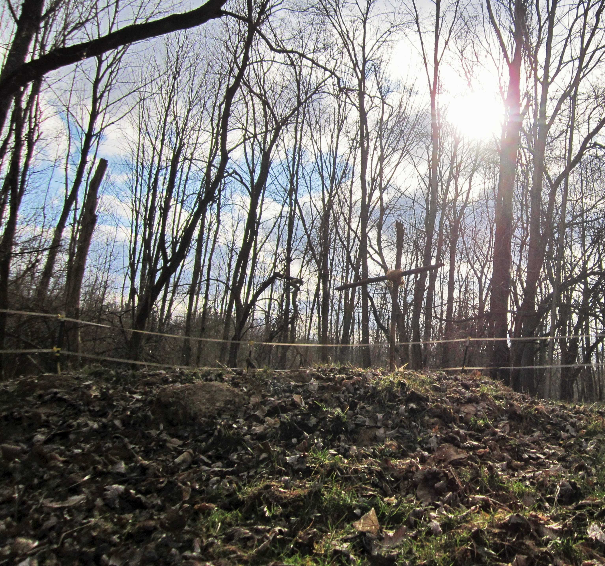

<h3>God is a Horseman #3:</h3>

 

<h3><i>Gone</i></h3>

Last week, my horse Jordache died.

The first horse I ever owned.  The first horse I taught to lead.  The first horse I broke to ride.  The list of firsts is too long to put down.  To sum up, he was my first.  In some ways, though I have and will love many other horses, he was my only.  

This horse was the center of my equine world.  Long before he began to decline, I found myself wondering if I would even be interested in horses anymore when he was gone.  Silly me--horses are in my blood.  Whether or not they are golden chestnut, or have a broad, fuzzy-edged white star on their foreheads, or even whether they nicker, deep-throated and demanding, whenever I'm a little late to feed.

Every time I think that I will never see this horse alive again, my heart breaks in pieces.  Perhaps God will resurrect Jordache for me when I join God in his forever; I don't know enough about what he has in store to say.  But would Jordache even want to have a master, in his heaven?

Do I want a Master, in mine?

That much I know the answer to.  Yes.  I want my Master there.  Even if there is more work to do.  Even if the burdens he puts on my back are heavier than those I bear now on Earth.  Even if the hours are longer, even if it never ends.  Why?  Not for hope of riches, pleasure, or ease--no, not at all.  My Master's presence is the sweetest thing I know.  To be closer to him would be more reward, and more fuel for service, than I will know in this life.

I can only hope that, could I have asked him, Jordache would have said the same of me.

<noscript>Please enable JavaScript to view the <a href="https://disqus.com/?ref_noscript" rel="nofollow">comments powered by Disqus.</a></noscript>

