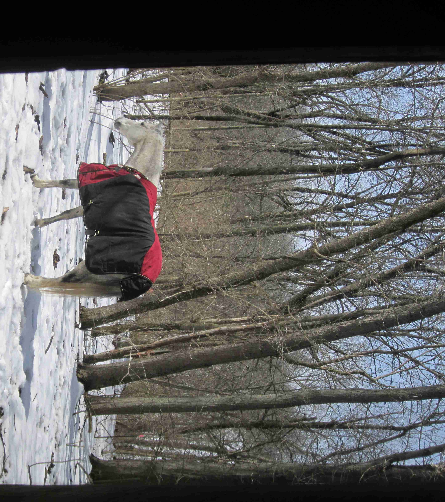

<h3>God is a Horseman #4:</h3>

 

<h3><i>Explaining Reality</i></h3>

 

Today it is bitter, bitter cold.  The wind bites with icy teeth; the thermometer is hovering around zero.  But it's still beautiful outside.  The pastures around my house and barn are covered with diamond-crystal white that crunches and moans under foot.  The sun's thin, yellow light slants through the trees, casting paintings of their branches in shadow on the snow.

And on this very wintry day, I find myself standing out in my overly-chilly barn.  A warm horse blanket lays over my arm, and I am staring down a horse who doesn't want that blanket on his back.

Despite the winter beauty, I worry for my horses.  Every winter here in Ohio, there are at least a few days of deep chill, and today is one of them.  Tonight it's supposed to drop to ten below.  My horses have already been blanketed for weeks.  Now, this early January afternoon, I'm out here piling even more insulation on them.  I know, their genes originally came from the Steppes of Asia, where colder winds blew and weeded out their ancestors.  Only those who could handle icy climes delivered their genes to the modern horse.  Plus, the barn walls and plentiful hay I give them are probably more than they need to survive.  But I don't want them to just *survive*; I want them to *thrive.*  So out I go, to reassure them that I am with them even in the cold, and to put yet another blanket on their backs.

Biting, my cuddly bay gelding, stands quietly for his new coat.  I don't need an ounce of restraint to keep him still as I throw it on and fasten it around him.  Lately he seems to want the extra warmth.  In his younger years, he would run away when I brought it, or doff it in the muddiest spot of the pasture the night after I got it on.  Age, perhaps, is slowing the burn of his inner furnaces.

Prince, however, is a different story.  Prince is a small, dappled gray gelding, younger than Biting by a few years and much newer to my care.  He came a couple of months ago from my mother's--a gift, since she didn't want a non-breeding horse at her breeding farm, and because she knew I liked this cute little guy.  He has a refined Arabian head with big eyes and a dished forehead, plus a showy gait and a super-excitable attitude straight out of the show ring.  This is a little troublesome, however, when all you want is a calm barn.  He has the tendency to over-react to the slightest movement.  He's been known to dash away in terror when I'm only taking off my coat, or jump when I toss a grain dish into the hay loft, for just the hundredth time since he got here. 

The story is no different today.  When I carry a big, cozy horse blanket over towards him, its thick insulation rustling and frothing over my arms, its metal fasteners clanking away, Prince gets a little nervous.  He proceeds to walk away from me--that is no surprise.  So instead I hang the blanket up and grab a halter, to hold him with while I put on his extra coat.  And that is when the fun begins.

I move gently up to Prince with the halter.  He takes a long, suspicious look at me with his big, richly dark eye, wheels, and heads the other way.  Prince is generally comfortable with me when I don't have a halter on my shoulder, so I know what that means.  *I'm not letting you catch me!*  

My barn is open and spacious inside, so Prince can easily move away from me.  Giving him another chance, I walk up to him again.  Again, he leaves.  

Now, I realize, I have some explaining to do.

     If you will only obey me,
         you will have plenty to eat.		 
     But if you turn away and refuse to listen,
         you will be devoured by the sword of your enemies.
     I, the Lord, have spoken!
	    --Isaiah 1:19-20 (NLT)

I raise my hand and gently drive Prince out of the barn, which has only one door open to the frigid outside.  Then I shut that door.

 

 

In running away from me and my halter, Prince forgot the real reason he should follow me:   

*I provide.*  

I provide the barn, which keeps the wind off his back and holds the herdmates that are his precious friends.  I provide the hay, that fills his stomach and gives him life, and unfrozen water to slack his thirst.  I provide a hundred other things he can't begin to understand but that make his life comfortable and worth living.  

Just like God provides everything for me, from the flesh I live in to the ground I walk on to the very universe that pulses with His aliveness around me.  The moment I forget that He made all of this is the moment I start living in my own little dream world.

Like me, Prince has a tendency to forget the truth of his master's provision and live in that self-sufficient little dream world too often.  But for him, no longer.  

Prince still has a blanket on, so he isn't going to get hypothermic outside in just a few minutes.  By shutting him out, I'm showing him that his head held high doesn't get him hay without *my* hand giving it.  His equine domineering doesn't earn him position in the herd unless *I* allow him into that herd.  Everything he has comes from me.  By shutting that door, I let him realize this on his own.  I don't need to do any more explaining than that.

I let Prince think outside while I tend to water buckets and adding a blanket to another horse.  Then, with all the other chores done, I pick up the halter again and go out that door, quietly shutting it behind me.  Prince is right there, pretty head still high, the thick, gray coat on his neck bright in the sunshine.  His eyes are on me.  

"Ready to try again, boy?"

Looking at him square on, I ask with body language if he'll submit to me.  He steps toward me and his head drops to shoulder level, as if he's reaching for the halter in my hand.  I can sense his eagerness to get back in the barn, and his acknowledgement that getting in is pursuant to submission.  I touch the soft fur on his neck as I guide his nose into the halter.  He follows me like a kitten following its mother.  He even accepts the blanket, though not without some negotiation--it's still just as scary as it was before I put the halter on, but now at least I can encourage him to stick around long enough to get the warmth he needs.  Not only will he be warmer tonight when the temperature drops *even further,* but my heart won't shiver, thinking of my chilly, stubborn Princey.  Because he was willing to see *reality,* and recognize how much he needs me, both he and I will be warmer.

And next time God's coming up with that halter, asking me to take that next step--do a little less of what he doesn't like, a little more of what he does, *give in* more--maybe I'll try to remember *reality,* too.

     A single day in your courts
         is better than a thousand anywhere else!
     I would rather be a gatekeeper in the house of my God
         than live the good life in the homes of the wicked.
     
	 For the Lord God is our sun and our shield.
         He gives us grace and glory.
     The Lord will withhold no good thing
         from those who do what is right.

     O Lord of Heaven’s Armies,
         what joy for those who trust in you.

	     --Psalms 84:10-12 (NLT)

 

 

For more passages on God's provision, check out the following links:
	from http://www.scripturepromises.com/promises/provision.pdf
	http://www.whatchristianswanttoknow.com/21-bible-verses-about-gods-provision
	http://bible.knowing-jesus.com/topics/God~s-Provision
	http://www.heavensinspirations.com/word-provision.html
	
