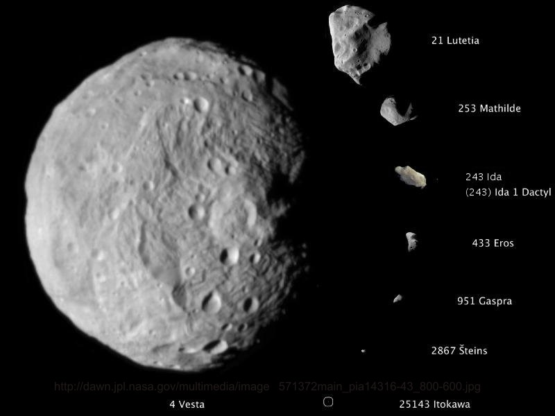

279 Thule\:  Farthest Asteroid from the Sun
===========================================

*What is it like, out there?*

So far out, we have no real pictures of it--none with any resolution, even with today's high-resolution telescopes.  We know it only as a dimple of dim against the black of space.  That dimple's brightness varies a little--so we know it rotates, and how fast.  Enough of its light reaches us that we can glean spectroscopic data, which tells us what it could be made of.  We have estimates of its dimensions, but no information on its mass or even its shape.  

As if it were some distant island on the horizon, just close enough to see that it's there, just far enough that we can't tell more.  It's sufficient for those of us whose eyes are caught by the far off, the unreachable, to make us wonder:  *What is it like out there?*

279 Thule is the setting for hard science fiction novel I'm working on right now, so I'm spending a lot of time out on that lonely little rock these days.  My research for that novel has turned up a lot of intriguing reasons why you might want to join me, *out there*....

- [How Far Out Is *Out There?*](#Distance)
- [What's It Made Of?](#Composition)
- [How Big Is It, and How Hard Does It Pull?](#Size)

 

<class="nofloat"><h3><a name="Distance">How Far Out Is <em>Out There?</em></a></h3>

 

279 Thule is a real asteroid, one of the many in the wide asteroid belt that lies between Mars and Jupiter.  "Farthest Asteroid from the Sun" is a bit of a misnomer:  Thule is the farthest of the "main belt" asteroids.  Many asteroids lie much farther, but also are well outside the "official" main belt.  The Hilda family of asteroids orbits lie in the "outer belt," between the main belt and Jupiter.  The Trojan asteroids lie a little further out, in and around Jupiter's own orbit.  Then there are the Centaurs, Neptune Trojans, and Trans-Neptunian objects which orbit even farther out than that--outside the traditional boundary of our Solar System.  But, at a minimum distance of 488 million kilometers (around 300 million miles) from Earth--more than three times the distance from Earth to the Sun--Thule is still pretty far out.  At the space shuttle's top speed of around 28 thousand kilometers per hour (17,500 mph), it would take at least two years to get there.  (see more Earth-to-asteroid distance calculations [here](LFA_calculations.xlsx).)

 

 

<h3><a name="Composition">What's It Made Of?</a></h3>

 

So if Thule is so far out, do we have any idea what it's made of?  Some, based on how it reflects the Sun's light.  In other words, based on spectroscopic information.  Spectroscopy is the main way most asteroids are characterized, especially those (like Thule) that are too far out to have had unfortunate relatives swing too close to Earth and become meteorites.    Those meteorites, swept up by and pored over by eager meteorite-hounds, understand the rocks in the asteroid belt the meteorites are related to.  Most asteroids that close to Earth are primarily metallic, heavy with minerals containing iron and other metals.  A few meteorites, however, have much higher carbon content--these, called "C-Types," match spectroscopically to asteroids further out in the belt.

Thule, however, is further out even than most C-types, and is still more different.  It belongs to a smaller class of asteroids known as "D-type."  Based on its spectroscopy, we know it's probably composed of carbon and organics, silica and silicates (essentially, sand).  In the end, it's probably something like sandy tar, or asphalt.  And hard, especially considering that the tar is frozen at the cold, cold temperatures in deep space far from the Sun's warmth.  So, hooray--we travel all that way, and end up on a little planetoid that looks like a parking lot.  What's more, since it's been exposed to radiation, meteorites, endless temperature cycling (due to its rotation), it probably looks like a very old parking lot--most of the organics on the top worn away, cracked, and complete with plenty of potholes.  Even older-looking still, the meteor strikes that caused the potholes (and larger holes, or craters, which litter all the asteroids close enough for pictures of) have also rained a fine dust of vaporized, then flash-frozen, Thule onto it's age-old surface.

What is truly unique about the D-type asteroids is that their composition is possibly the closest of all Solar System bodies to the original planetary building blocks.  According to current planetary formation theory, after the Solar System's original, formless mass coalesced into a "pre-planetary disk" around the Sun, the material in the disk then condensed into stones, then asteroids, then planets.  Some of those asteroids, though, never became planets--these mostly reside in the asteroid belt.  The asteroids closer to the Sun--the "inner belt"--got a sort of heat-treatment, much like the rocky planets (Earth, Mars, Mercury, and Venus) that boiled off a lot of the organics, and even melted the rock and metal comprising them, allowing the metal to settle into the heart of the planet (or asteroid), leaving a hard, rocky surface covering a deep, metallic core.  Thule and the other D-types were too far away from the Sun to get such a heat treatment, and so probably better resemble the material form that all the bodies further in started from.  

One advantage of this undifferentiated carbon-silicate composition (at least for speculative story-telling) is the potential for impact-formation of unusual materials (mining just such a (fictional) material is the reason my characters head out to Thule in my novel).  Silicate materials with very different properties (such as structure or density) than normally found on Earth have been found in meteorite craters, which opens up all kinds of interesting possibilities for what we might eventually find, *out there,* where asteroids collide at relative speeds of thousands of kilometers a second, with no atmosphere to slow them down.  Though these collisions are far more rare than the collision-dense asteroid fields portrayed in Star Trek or Star Wars may lead us to believe, they can still pack quite a wallop.  (See my calculations for the astronomical stresses and pressures that might be involved in such a collision [here](LFA_calculations.xlsx).)  It also opens up possibilities for interesting scenery--what would these materials, should they be shown at the surface, *look* like?

 

 

<class="nofloat"><h3><a name="Size">How Big Is It, and How Hard Does It Pull?</a></h3>

Another unique thing about Thule is its size.  Despite being so far out, it was one of the first few hundred asteroids observed and catalogued, way back in 1888--back before orbiting observatories, infrared imaging and all of modern astronomy's tricks for probing far away objects.  It was found back then despite the fact that it isn't the brightest thing out there; Thule has only middling brightness among the asteroids.  But it is one of the *biggest* asteroids out there; only 122 main-belt asteroids are bigger, of the thousands and thousands and thousands out there.  The picture above illustrates this.  4 Vesta is among the very biggest at around 540 km in diameter, smaller in size only than 2 Pallas and the monster asteroid, 1 Ceres--the only asteroid big enough to be labeled a "minor planet."  Thule, though nowhere near that big, is still up there, being closer to 21 Lutetia.  As you can see from the numbers before the names (which denote the order in which the asteroid was discovered), most asteroids are much, much smaller than our destination.

Size gives us one other very important factor in any discussion of living or working there:  gravity.  Not much gravity, mind you.  Based on my "educated guess" calculations, the gravity at Thule's surface would be roughly 0.2% of Earth's--a man who weighed 200 pounds on Earth would weigh a fraction of a pound on Thule. (This calculation assumes that Thule's density is the same as 624 Hektor, another D-type asteroid.  You can take a look at exactly how I calculated Thule's gravity [here](LFA_Calculations.xlsx).) 

Also, since the force of gravity is weaker, the acceleration due to gravity is less as well.  On Thule, falling three feet would take a little more than ten seconds!  This makes for a very, very foreign feel to our far-off destination--perfect for adventurers like us.  Notably, this gravity, though tiny, is more than sufficient (by a couple of orders of magnitude) to hold things onto its surface while Thule rotates--otherwise, it would be awfully tough to land a space ship there!

In the end, we read science fiction to go to places *out there,* places we couldn't even dream of, places that pique our interest, wow our senses, and stir our minds.  Thule's far away distance, its unusual chemical makeup, and its mix of significant size (the horizon on Thule is at least 0.5 km away, for a person standing on the surface) and nearly insignificant gravity compelled me to explore it.  And despite it being 488,000,000 km away, we can still go--with the help of the many astronomers who have studied it, and so many of the other rocks wandering around the Asteroid Belt.  And, perhaps, with the help of a science fiction author or two, as well.  

--*Christie*

P.S.:  In case you're interested in finding out more about Thule or asteroids in general, here's a list of places where I found much of the above information, and more:

<h4>279 Thule:</h4>
- [Wikipedia's page on Thule](http://en.wikipedia.org/wiki/279_Thule)
- [Scientific Journal article on Thule] (http://onlinelibrary.wiley.com/doi/10.1111/j.1365-2966.2008.13764.x/abstract;jsessionid=828F55B9D37217002B45C7FB20855CDB.d03t04)
- [http://adsabs.harvard.edu/full/1990RMxAA..21..585T](http://adsabs.harvard.edu/full/1990RMxAA..21..585T)
- [And my favorite:  NASA/JPL's small-body database page for Thule](http://ssd.jpl.nasa.gov/sbdb.cgi?sstr=279)

<h4>153 Hilda:</h4>
- [Wikipedia's page on Hilda](http://en.wikipedia.org/wiki/153_Hilda)
- [http://en.wikipedia.org/wiki/Hilda_family](http://en.wikipedia.org/wiki/Hilda_family)

<h4>Asteroids in General:</h4>
- [http://commons.wikimedia.org/wiki/File:Asteroid_Belt-is.png](http://commons.wikimedia.org/wiki/File:Asteroid_Belt-is.png)
- [http://www.nasa.gov/worldbook/asteroid_worldbook.html](http://www.nasa.gov/worldbook/asteroid_worldbook.html)
- [http://www.astronomyexpert.co.uk/AsteroidBelt.html](http://www.astronomyexpert.co.uk/AsteroidBelt.html)
- [http://library.thinkquest.org/18652/asteroid.html](http://library.thinkquest.org/18652/asteroid.html)

<h4>D-type asteroids:</h4>
- [http://ntrs.nasa.gov/archive/nasa/casi.ntrs.nasa.gov/19920001612_1992001612.pdf](http://ntrs.nasa.gov/archive/nasa/casi.ntrs.nasa.gov/19920001612_1992001612.pdf)

<h4>Asteroid collisions:</h4>
- [http://www.space.com/11537-nuclear-force-asteroid-collisions-aftermath.html](http://www.space.com/11537-nuclear-force-asteroid-collisions-aftermath.html)
- [http://www.space.com/11218-asteroid-collisions-wrecking-balls-experiment.html](http://www.space.com/11218-asteroid-collisions-wrecking-balls-experiment.html)
- [http://spacemath.gsfc.nasa.gov/weekly/6Page141.pdf](http://spacemath.gsfc.nasa.gov/weekly/6Page141.pdf)
- [http://www.absoluteastronomy.com/topics/Hypervelocity](http://www.absoluteastronomy.com/topics/Hypervelocity)

<h4>Unusual silicate materials:</h4>
- [http://en.wikipedia.org/wiki/Seifertite](http://en.wikipedia.org/wiki/Seifertite)
- [http://en.wikipedia.org/wiki/Stishovite](http://en.wikipedia.org/wiki/Stishovite)
- [http://en.wikipedia.org/wiki/Coesite](http://en.wikipedia.org/wiki/Coesite)

