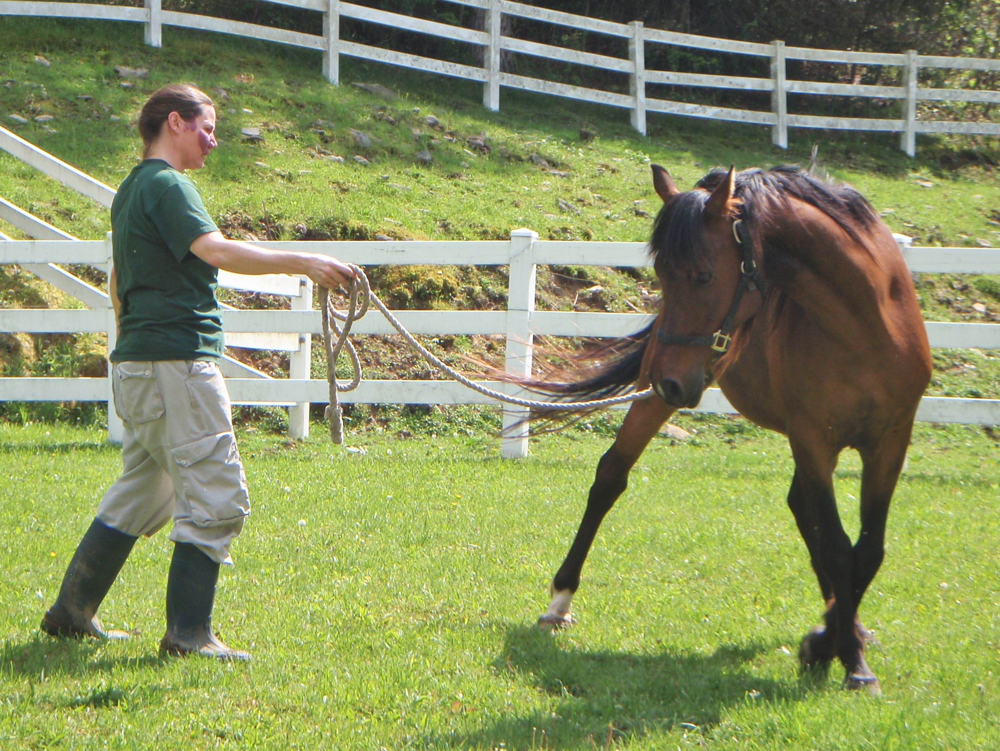

Christie writes in a wide range of genres, from the inspirational to the fantastic.  Here's what she's working on these days:

## [God is a Horseman: About Horses and Horsemen, and Horsemen and God](GIAH/giah.html)

> "Curly is looking at me.  His thick, gracefully curving neck is drawn up over his well-muscled russet shoulders.  His bountiful black mane froths downward in matted locks behind his chiseled head, and his bright white star is half-hidden by the forelock draped over his eyes.   He's facing me, broad chest pointed right at me as if ready to run me down, his large, liquid eyes trained on me intently.  I'm pretty sure he's wondering why I've put him in this fenced paddock, separate from all the other horses, and what I'm going to do to him...."

<h2 class="nofloat"><a href="LFA/279_Thule.md">279 Thule: Farthest Asteroid From The Sun</a></h2>

A short article about the science behind Christie's current sci-fi book project.... including calculations estimating its gravity, how fast you'd have to go to get there, and more for the space science enthusiast.

[Meditations on The Bible](MED/meditations2.md)
------------------------------------------
Short devotional conversations with God and the book I understand him through.

[About Christie](BIO/bio5.md)
------------------------------

[Writing Links](WRI/writing.md)
---------------------------
